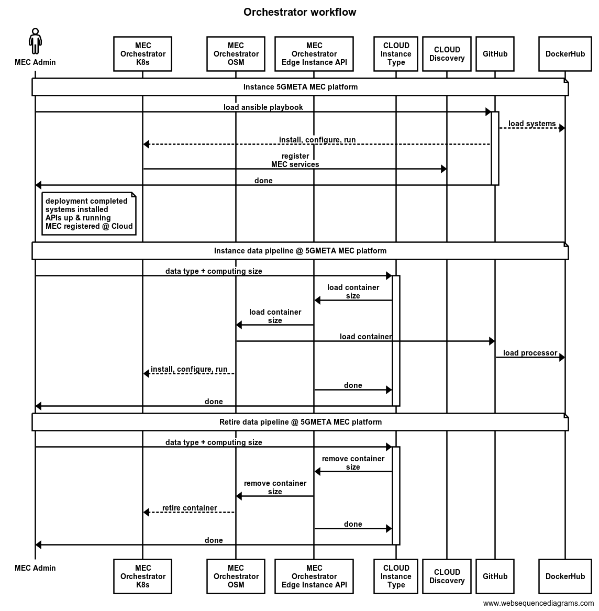

# The 5GMETA Multi-Access Edge Computing (MEC)  Platform

## Introduction 

This repository contains the components of the 5GMETA MEC Platform which servers the third-parties to request the deployment of  their pipelines  to handle specific data-types. This repo includes:
 - source codes of the MEC Platform API server and MEC platform applications (LCCAM, Data Quality, etc.)
 - the scripts to deploy the 5GMETA MEC Platform


The architecture of the MEC Platform is illustrated  by the figure below:

<p align="center">


MEC Architecture
</p>

The interaction with the MEC Platform is illustrated by the figure below.

<p align="center">


Sequence Diagram of exchanged Messages
</p>


## Deployment of the MEC Platform

The deployment of the 5GMETA MEC Platfrom will :

- Install [ETSI Open Source MANO (OSM)](https://osm.etsi.org/) on a Ubuntu Server as described here: https://osm.etsi.org/docs/user-guide/latest/01-quickstart.html#installing-osm
- Install the  baseline/default building blocks of the 5GMETA MEC platform
- Register of the MEC platform in the 5GMETA Cloud platform.

The following is done manually:
- Configuration of ETSI OSM


TODO:

Notary and Connaisseur for managing security in the cluster are disabled in the current version.


The process is illustrated as follows:

<p align="center">


5GMETA MEC Platform Deployement steps
</p>

Once deployed, the different services can be accessed in the next ports:

- OSM UI in port [https://your-mec-fqdn](https://your-mec-fqdn)
- OSM API (Orchestration API) in port [https://your-mec-fqdn](https://your-mec-fqdn)
- Grafana UI in port [https://your-mec-fqdn/grafana/](https://your-mec-fqdn/grafana/)
- 5GMETA MEC Platform API Server [https://your-mec-fqdn/api/v1/](https://your-mec-fqdn/api/v1/)
- 5GMETA Message-Brokers:
   - [Port 8161 for Broker UI](https://your-mec-fqdn/broker-ui/)
   - [Port 5673 for producing data, clients)](your-mec-fqdn:30672)
   - [Port 61616 of ActiveMQ, Kafka Connectors, Internal](your-mec-fqdn:30616)
   - https://your-mec-fqdn:30672 (SB) and https://your-mec-fqdn:30616 (NB)
- 5GMETA Video-Broker in https://your-mec-fqdn:8443/, :<32000-32098>


### Prerequisities

The required resources to install [ETSI Open Source MANO (OSM)](https://osm.etsi.org/docs/user-guide/latest/index.html) are:
- One Machine for OSM with RECOMMENDED: 4 CPUs, 16 GB RAM, 80GB disk and a single interface with Internet access
- One Machine to deploy a  K8s cluster to be used by ETSI OSM
- The 2 machines should be on the same network.
- Use the OSM recommended base image: Ubuntu22.04
   - Ubuntu22.04 cloud image (64-bit variant required)
   - Ubuntu22.04 server image (64-bit variant required)
- [Ansible](https://docs.ansible.com/ansible/latest/index.html)


#### Prerequisities for a local development environment

- [VirtualBox](https://www.virtualbox.org/)
- [Vagrant](https://developer.hashicorp.com/vagrant/tutorials/getting-started/getting-started-install?product_intent=vagrant)
- In the develpment environment, vagrant is used with VirtualBox as a provider to instanciate the MEC platform and implement the deployment procedure described earlier.


### Deploying the MEC Platform

#### MicroK8s used to provide a Kubernetes cluster to OSM

The Microk8s can be used on the following resource: 4 vCPUs,  16 GB RAM, 80GB of RAM either on VirtualBox or MS Azure. In this document, MS Azure is considered as defautl.But, other Kubernetes distributions, etc. can be installed and configured in OSM.

To install MicroK8s type the following commands:

```bash
sudo snap install microk8s  --classic
sudo usermod -a -G microk8s `whoami`
newgrp microk8s
microk8s.status --wait-ready
microk8s config > config_to_be_imported_in_osm.yaml
```

The file 'config_to_be_imported_in_osm.yaml' must be copied in the MEC Platform (the server hosting OSM).

A new features of the 5GMETA  MEC Platform is to use Opencoast for monitoring the cost of the 5GMETA pipeline.

**Install OpenCost on Microk8s**


**Install Prometheus as required by OpenCost**
```bash
helm install prometheus --repo https://prometheus-community.github.io/helm-charts prometheus \
  --namespace prometheus-system --create-namespace \
  --set prometheus-pushgateway.enabled=false \
  --set alertmanager.enabled=false \
  -f https://raw.githubusercontent.com/opencost/opencost/develop/kubernetes/prometheus/extraScrapeConfigs.yaml
```

**Install Opencost**

```bash
helm upgrade opencost --repo https://opencost.github.io/opencost-helm-chart opencost \
  --namespace opencost --create-namespace
```


##### Deployment of the  the MEC Platform

To install the MEC Platform on an a VM or a physical server :
- Modify the inventory file to set the IP address and the ssh user
- Then type:

```bash
cd deploy/ansible
ansible-playbook -i inventory.ini 5gmeta-mec-platform-playbook.yaml --private-key your_private_key
```

#### Configure the Hostname for OSM Client

To login to the OSM Web UI type:

```bash
export OSM_HOSTNAME=$(kubectl get -n osm -o jsonpath="{.spec.rules[0].host}" ingress nbi-ingress)
echo "OSM_HOSTNAME (for osm client): $OSM_HOSTNAME"
kubectl get -n osm -o jsonpath="{.spec.rules[0].host}" ingress nbi-ingress
```

#### Post OSM installation configurations

##### Create a VIM for deploying the Pipelines

5GMETA uses pipelines which are Docker containers chained together for a specific data processing. In OSM, a VIM account is created and used to configure a VIM. To create a VIM account, type:
```bash
sudo snap install osmclient
osm vim-create --name 5gmeta-vim --user admin --password admin --tenant admin --account_type dummy --auth_url chagne_with_the_auth_url
```

Add MicroK8s cluster as K8s cluster
```bash
osm k8scluster-add --creds config_to_be_imported_in_osm.yaml --version 'change_with_mk8s_version' --vim 5gmeta-vim --description "Microk8s cluster" --k8s-nets '{"net1": "osm-ext"}' microk8s-cluster
```

#### Configure the repositories using OSM UI

The following configuration need to be done through the UI:
- Use the OSM UI to import the VNF with are in /home/azureuser/osm
- Create a K8s Helm repository using this URL


#### Check OSM and 5GMETA MEC modules installation

Also you can check the status of OSM ressources managed by Kubernetes in the following way:

```bash
kubectl get all -n osm
```

## Development of MEC Services


The development of a pipeline begins by the creation of the different module images. Next, a helm chart should be created where the behaviour of the modules in a MEC's K8s cluster are defined. Finally the OSM descriptor should be created so that the pipeline is orchestrated in the MEC.
When a third party requests for a data type in the cloud, after all the necessary operations are made in the cloud, the cloud will forward the request to the Instance API in the selected MEC. This API will check if there are available resources in the MEC to deploy the data-type pipeline for the requested instance type. If available, the request will be forwarded to the OSM Orchestration API and the pipeline will be deployed.


## Conclusions and Roadmap


# TODO

- [] Ensure that this documentation is complete (contains the H2020 relevant information)


## Credits

- Djibrilla Amadou Kountche
- Federico Princiotto ([federico.princiotto@linksfoundation.com](mailto:federico.princiotto@linksfoundation.com))
- Mikel Serón Esnal ([mseron@vicomtech.org](mailto:mseron@vicomtech.org), [GitHub](https://github.com/mikelseron))
- Felipe Mogollón ([fmogollon@vicomtech.org](mailto:fmogollon@vicomtech.org))
